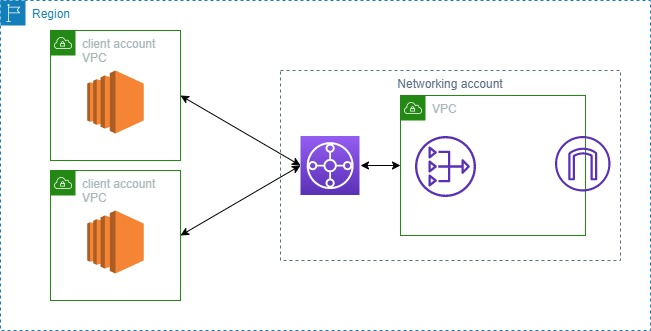

# Centralized outbound routing

## 개요
각각 개별의 VPC에서 NAT 게이트웨이를 생성할 필요없이, NAT 게이트웨이와 인터넷 게이트웨이가 포함된 중앙 VPC를 생성하고 outbound 트래픽을 라우팅하도록 Transit Gateway를 구성하는 예제
 
<a href="https://docs.aws.amazon.com/vpc/latest/tgw/transit-gateway-nat-igw.html">https://docs.aws.amazon.com/vpc/latest/tgw/transit-gateway-nat-igw.html</a>

## 프로젝트 구조

## 블로그 링크
<a href="https://lunacircle4.github.io/infra/2021/07/22/tgw-central-egress/">https://lunacircle4.github.io/infra/2021/07/22/tgw-central-egress/</a>

